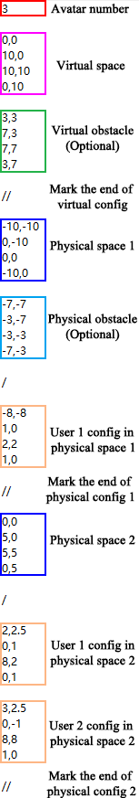

## 
OpenRDW 2: A Redirected Walking Evaluation Toolkit Supporting Multi-user online VR

This project is a toolkit for evaluating **Redirected Walking** methods in virtual reality (VR).

This toolkit is an extended version of [OpenRDW](https://github.com/yaoling1997/OpenRDW) that retains most of its features while introducing many upgrades. One of the most significant new features is that OpenRDW 2 supports the simulation of multi-user online VR scenario, that is, it supports the simulation of multiple users in different physical spaces while playing in a common virtual space. Such kind of online VR scenarios are becoming increasingly common with the development of cloud rendering technology and the Metaverse. To the best of our knowledge, this project is the first redirected walking simulation toolkit that supports this type of multi-user offsite online VR applications.

In multi-user online VR applications, if everyone is not associated with others, the redirected walking strategy will not differ from single-user strategies. But if users' tasks are correlated, there will be new challenges to redirect users. An ideal online RDW strategy must make the locomotion opportunities of different users equal, regardless of different physical environment layouts. Otherwise, some online VR games, such as the multiplayer game “Red Light, Green Light”, will become unfair and even lose their playability.

This code contains the implementation of the multi-user online RDW controller described in the paper [Multi-User Redirected Walking in Separate Physical Spaces for Online VR Scenarios](https://arxiv.org/abs/2210.05356). This controller is designed for multi-user online VR scenarios and ensures that online users in separate physical spaces have the same number of resets and reset timings while reducing the number of resets for all users.

This code retains most of the features of [OpenRDW], so we also highly recommend reading and using the original [OpenRDW] and [its wiki](https://github.com/yaoling1997/OpenRDW/wiki/Introduction).

### Simple Setup

This project was developed using Unity 2019.4.31f1. To get started, clone the project and open it.

To use all the features, you will need to install two additional plugins: [PUN 2 - FREE](https://assetstore.unity.com/packages/tools/network/pun-2-free-119922) and the [SteamVR Plugin](https://assetstore.unity.com/packages/tools/integration/steamvr-plugin-32647). Simply download and import them using Unity's package manager when needed.

Once you have everything set up, open the ***OpenRDW Scene*** and start playing to see the visualized simulation process!

### Project Structure

The main ***OpenRDW Scene*** is located at `Assets/OpenRDW/Scenes/OpenRDW Scene.unity`.

All scripts can be found in `Assets/OpenRDW/Scripts/`:
The `Experiment` directory contains experiment-related codes and is responsible for logging experiment statistics. 
The `Movement` directory contains codes that controls the motion of the avatars, and `MovementManager.cs` is the most important file of them. 
The `Networking` directory contains codes that works with PUN2, which is only necessary if there are networking-experiment requirements. 
The `Others` directory contains the key file in this project, `GlobalConfiguration.cs`, which configures most of the parameters and controls the entire experiment process. 
The `Redirection` directory contains several implemented redirectors and resetters, with `RedirectionManager.cs` managing them. 
The `Visualization` directory contains codes that focuses on visualization effects in the Unity scene.

Text files in `BatchFiles/` and `CommandFiles/` aim to perform large-scale simulation experiments.  

The `Experiment Results/` directory saves the result statistics of every experiment performed.

The `TrackingSpaces/` directory contains text files that could configure the virtual and physical environments of the experiments, as well as avatars' initial poses.

Files in `WaypointFiles/` contain coordinates of the waypoints.

### Implement your own Redirectors and Resetters

To implement a new redirector, go to `Assets/OpenRDW/Scripts/Redirection/Redirectors` and create a new class that extends the `Redirector` class. Then simply implement the `InjectRedirection` abstract function. It is called each frame and sets several gains for redirection. On finishing this, add this redirector to the `RedirectionManager`.

Implementing a resetter in accordance with the redirector could be done similarly. Simply extend the `Resetter` class and implement a new class. You can refer to other resetters as examples. Also, don't forget to add it to the `RedirectionManager`. 

### Some key settings

The ***OpenRDW*** gameobject serves as the main object. The ***Global Configuration*** component of it controls most of the crucial settings for the experiment.

In the ***Experiment*** section, the `Movement Controller` decides how to control the avatars' real movement. <u>Auto Pilot</u> is usually for simulations, while <u>HMD</u> supports real-user experiments. When the simulations `Run In Backstage`, they would run much faster, but without visualizations. It is recommended to always check it when performing batch experiments. You can load a pre-prepared command file by checking the `Load From Txt` box. Otherwise, the experiment configuration set by the UI panel will be used.  

For real-user experiments, `Use Reset Panel` and `Use Crystal Waypoint` may turn out to be helpful.

For simulations, `Path Length` decides how long each avatar needs to walk before the experiment ends. `DEFAULT_RANDOM_SEED` is the seed for waypoint generation. Some thresholds could be adjusted to match a variety of cases.

The `Synchronized Reset` checkbox decides if all avatars start and end resets together. It could make a difference in a multi-user simulation scenario.

In the ***Avatar*** section, the `Avatar Num` controls the number of avatars used in the experiment. If you only want to experiment on a single user, just set this value to 1. `Translation Speed` and `Rotation Speed` decide how fast an avatar can walk and turn.

In the ***Tracking Space*** section, the `Tracking Space Choice` controls the shape of the physical tracking space, you can also load custom tracking space from a local txt file by setting this value to <u>File Path</u> and filling in the <u>Tracking Space File Path</u> slot. It is recommended for complex experiment environments. For the predefined space choices, the `Obstacle Type`, `Obstacle Height`, and `Square Width` control the detailed settings.

In the ***Path*** section, the `Draw Real Trail` and the `Draw Virtual Trail` boxes control whether to show the real and virtual trails respectively. `Trail Visual Time` decides how long the the path trail will be reserved.

In the ***Analysis*** section, the `Export Image` box controls whether to export the image of the walking process. 

The ***Statistics Logger*** component focuses on experiment results. If the `Log Sample Variables` box is checked, then some variables during the experiment would be logged. The ***Image*** section of the component controls the image exported. The results are saved to the `Experiment Results/` directory by default.

The child gameobject ***Redirected Avatar*** decides how to perform the redirection. `Redirector Choice` and `Resetter Choice` in the ***Redirector Manager*** component are the RDW controllers for the experiment. The `Path Seed Choice` decides the distribution of waypoints, and <u>Random Turn</u> is the default choice.

During a visualized experiment, you can press the key `~` to have an overview of the physical spaces. Press `TAB` to switch to the virtual space. Moreover, you can press the number keys to have the following view of certain users, e.g. `0` for the first user.  Note that if one user has misaligned virtual and physical initial poses, the following view could work improperly. 

[Video Capture](https://assetstore.unity.com/packages/tools/video/video-capture-75653) is integrated into the project. It allows you to record videos freely during the experiment. Somehow, the recording could degrade running performance, so you may try out other approaches if required.

### Tracking Space Settings

One feature of this OpenRDW version is that it supports experiments in **multiple physical spaces**. To try out this, set the `Tracking Space Choice` to <u>File Path</u> and set the `Tracking Space File Path` to <u>TrackingSpaces/Separate3/3_squares.txt</u>.

A tracking space file sets the physical and virtual spaces, as well as the initial configurations of each user for a simulation experiment. A sample is explained below:

The first line suggests the number of users (or avatars) participating in the experiment.

The first section configures the **virtual environment**. By default, a polygon space is defined by **coordinates of several vertices in a counter-clockwise manner**. A single closed virtual space is required in this case. However, you can set the coordinates far enough away from each other to make it "open". Additionally, several obstacles could be set to complicate the virtual environment, but it is totally optional. 

The following sections configure the **physical environments**. Multiple physical spaces are supported, as well as multiple obstacles in a certain physical space. Each section represents one physical space, with multiple users walking in it. Initial positions and orientations are required for every user. The four coordinates represent the **physical location, physical orientation, virtual location, and virtual orientation** of a user, respectively. It is recommended that virtual poses align with physical ones, unless under special circumstances.

Some marks are needed to split the sections. Do remember to add them properly.

All waypoints of the avatars are supposed to fall in the closed virtual space. If the virtual space is narrow, you can set the `Path Seed Choice` to <u>Valid Path</u> instead of <u>Random Turn</u>. You could refer to the scripts `Others/TrackingSpaceGenerator.cs` and `Movement/VirtualPathGenerator.cs` for detailed implementations.

### Batch Experiments

It would be too annoying to manually run hundreds of experiments for comparing different RDW controllers. To tackle this, the project allows you to run a series of experiments once your **command file** is ready. Simply check the `Load From Txt` box in the ***Global Configuration*** component and select the command file you want when you start the experiments.

A command file may look like this:

To customize an experiment, several parameters are required. <u>Redirector</u> and <u>resetter</u> decide the controllers, while <u>pathSeedChoice</u> and <u>trackingSpaceChoice</u> decide waypoint patterns and experiment environments. A user is marked by <u>newUser</u> and could have its own <u>randomSeed</u> for its waypoint pattern (optional). These experiments would be run sequentially.

More examples could be found in the `CommandFiles/` directory.

However, writing these command texts manually still poses trouble facing large-scale experiments. This is when a **batch file** comes into play:

A batch file may seem similar to a command file in some manners. This time, you need to set a series of values for some crucial parameters instead of one. It could result in **cross-style** experiments, which are suitable for comparing the performance of different controllers in several environments. For example, if repeated trials are required, simply set the <u>trialsCount</u> parameter.

Batch files must be transformed to command files to be recognized. The gameobject ***BatchExperimentGenerator*** provides this service. You can select the paths and generate the command files in the Unity Editor.

More examples could be found in the `BatchFiles/` directory.

### About the Virtual World

The ***Virtual World*** gameobject could be customized to meet the requirements of any experiment. The default environment contains a simple maze and a large-scale terrain. When `Use VE Collision` is checked, avatars could actually 'push' the virtual maze and alter its position and direction for better visualization. This is quite an useful feature, and details could be found in `Movement/VECollisionController.cs` and files related.

The virtual environment is designed to optimize the user experience in a real-user study. Crystal-shaped waypoints and a user-friendly reset panel could also be utilized in real-user cases. However, the virtual environment isn't necessary for simulations and can be disabled.

### About SeparateSpace Redirector/Resetter

The controller is an implementation of the paper [Multi-User Redirected Walking in Separate Physical Spaces for Online VR Scenarios](https://arxiv.org/abs/2210.05356).

It works under a specific circumstance:

- **Multiple users locate themselves in separate physical spaces**, with one user in each physical space.
- The users are performing tasks in **the same open (boundless) virtual space**.
- The tasks are related, so users must **start and end a reset synchronously**. It means that when any user triggers a reset, other users must reset too. And the synchronized reset couldn't end until everyone faces his/her desired direction. The suggested ideology is called '**locomotion fairness**'.
- All users **walk at a constant speed in the virtual space**, instead of the physical space. 

Note that the scripts need to be slightly adjusted in accordance with the change of physical spaces. See `Redirection/Redirectors/SeparateSpace_Redirector.cs` for details (A 'TODO' mark could guide you to the part).

### Some Tips

**IMPORTANT: When experimenting in HMD mode, remember to press 'R' to start.**

Experiments can be manually ended by pressing 'Q'.

Running experiments backstage blocks the main UI process to speed up the processing, and you couldn't check how it goes. So it would be better to double-check before running a time-consuming simulation.

**APF-related redirectors may not be robust to the reset buffer**. It is recommended that `RESET_TRIGGER_BUFFER` be set to at least <u>0.4</u> to get rid of malfunctioning. 

Always set the `Avatar Num`, `Tracking Space Choice`, `Redirector Choice`, and `Resetter Choice` correctly, or something unexpected could happen.

We use the [SteamVR Plugin](https://assetstore.unity.com/packages/tools/integration/steamvr-plugin-32647) for HMD development. For those who wish to conduct a live-user study, [SteamVR](https://store.steampowered.com/app/250820/SteamVR/) may be required. For HTC Vive HMD users, the Vive toolkits may also be required. 

The networking features supported by PUN2 only synchronized avatars' transform (position and orientation). It might be tricky if you need other data to be synchronized.

The experiment configurations may not be robust to special cases. If you find the experiment results unexpected, try to refer to the samples and double-check your settings. You can report the issues if obvious bugs occur.

### Acknowledgement

This project is developed on top of the repository [OpenRDW](https://github.com/yaoling1997/OpenRDW) as well as its paper [OpenRDW: A Redirected Walking Library and Benchmark with Multi-User, Learning-based Functionalities and State-of-the-art Algorithms](https://ieeexplore.ieee.org/abstract/document/9583831).

This project uses several assets from the [Unity Asset Store](https://assetstore.unity.com/):

- [SteamVR Plugin](https://assetstore.unity.com/packages/tools/integration/steamvr-plugin-32647)
- [PUN 2 - FREE](https://assetstore.unity.com/packages/tools/network/pun-2-free-119922)
- [Video Capture](https://assetstore.unity.com/packages/tools/video/video-capture-75653)
- [3D Realistic Terrain Free](https://assetstore.unity.com/packages/3d/environments/landscapes/3d-realistic-terrain-free-182593)
- [Translucent Crystals](https://assetstore.unity.com/packages/3d/environments/fantasy/translucent-crystals-106274)
